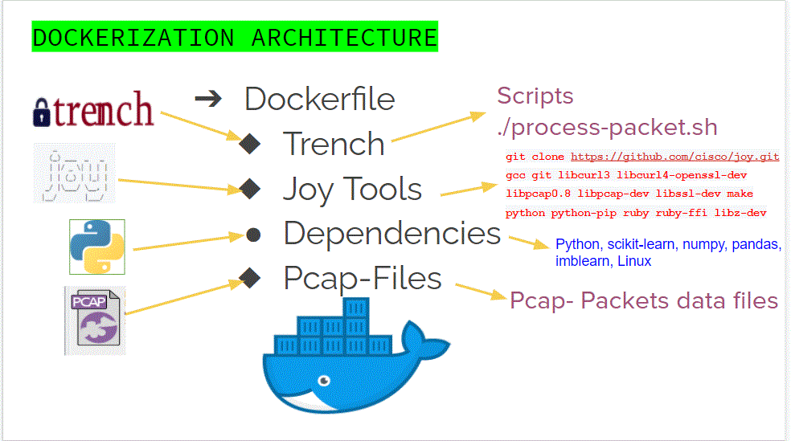

# AppWatcher
The emerging security threat analysis has shown that in 2019, digital transformation were haunted by new attacks resulting in huge data loss and complete breakdown of infrastructures. 
With the growth of distributed computing at a rapid rate, securing these infrastructure becomes a huge concern and Trench provides the solution.
Monitoring this huge distributed computing represents a very important aspect of an organization or an enterprise to determine the latency impact of this tool on incoming request and the performance of the system as a whole. 
Monitoring provides feasibility into the performance, security, health status and configuration of the infrastructure, providing a range of metrics and alerts into the whole system. Selecting the right monitoring tool is likewise as important as customizing the tool to provide valuable and specific metrics of the system.   
In addition, the cost effectiveness and saving resulting from the real time monitoring and quick intervention, is a huge plus to an organization.

# Provenance
This project involves deploying Trench as a containerized application and monitored to determine the latency and network traffic impact Trench has on incoming request. I deployed the application with a docker image as a fully containerized application in a simulated production environment. This Trench tool provides and detect malicious requests early, however this process impacts latency and subsequently user experience. In the light of this, I also monitored the application for performance using Prometheus and Grafana to provide feasibility, auto-scalling and quick intervention into the distributed computing when the bottleneck in traffic arise.

 
 # Dockerization
 The Trench system was dockerized to make it portable and run independently of other applications. It also provides security and any inteference from other microsercices.
 I built the docker image to comprise the Joy tools, Trench systems, the dependencies and the Pcap files.
 

# System Architecture
I ustilized AWS, Docker, Prometheus, and Grafana to deploy and monitored the Trench application. The system was set up in an AWS Virtual Private Cloud (VPC), the docker container was pushed into an Elastic Container Repository (ECR)in AWS. The Elastic Container Services was then used to launch series of EC2 clusters to run the application. The terraform tool was used in building and provisioning the infrastruture.

# Monitoring of the Container 
There is need for real time monitoring and visualization of metrics to resolve and prevent performance issues and provide auto-scaling to meet latency and traffic network problems.
I monitored the containerized application using the Prometheus and Node Exporter to scrape the metrics from the clusters ECS whenever the Trench tool is running. These metrics were relayed and forwarded to Grafana tool to provide visualization of the metrics through the dashboard. An Alertmanager is added to the monitoring tools and configured to create an alert through slacks and emails whenever the metrics are beyound the setup thresholds. The monitoring and alert tools were cloned from a GitHub repository (shown in the link below).  

https://github.com/stefanprodan/dockprom

